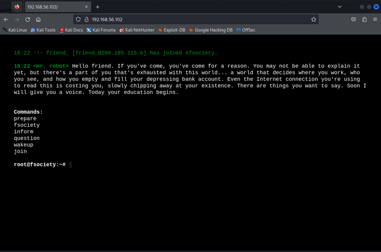
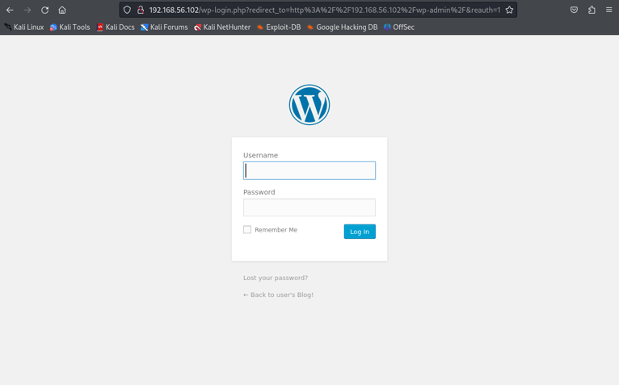
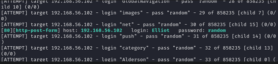
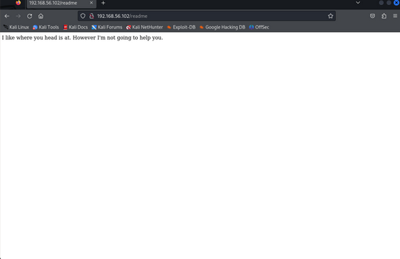
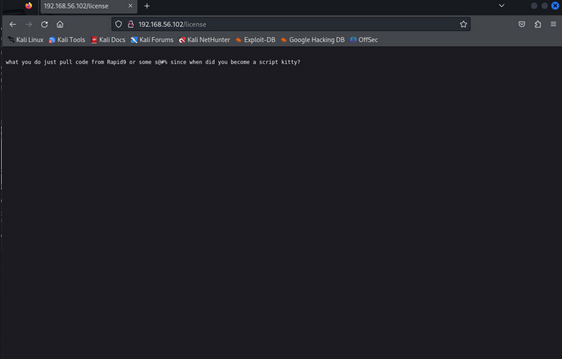

# Mr. Robot Writeup

## Objective:
The purpose of this project is to configure a virtualized test environment using Kali Linux to assess and exploit vulnerabilities in the Mr. Robot virtual machine. The primary goals are to develop practical skills in penetration testing and security reconnaissance, successfully identify system weaknesses, and capture specific security flags through simulated ethical hacking scenarios.

### Skill learned:
- Virtualization
- Recon
- Web enumeration

## Steps:
### Flag 1

#### Checklist:

- **Recon** 
- **Access**
- **More Recon**

### 1. Recon:
#### Basic info:

- **Kali IP:** `192.168.56.101`
- **Mr. Robot IP** (using Nmap): `192.168.56.102`

#### Nmap Scan Report for 192.168.56.102:
`Host is up (0.00078s latency).`  
`Not shown: 997 filtered tcp ports (no-response)`  
`PORT STATE SERVICE`  
`22/tcp closed ssh`  
`80/tcp open http`  
`443/tcp open https`  
`MAC Address: 08:00:27:2B:89:33 (Oracle VirtualBox virtual NIC)`  
`Nmap done: 155 IP addresses (2 hosts up) scanned in 41.70 seconds` 
- As we can see, we have three ports open, which means we could just put the IP address (192.168.56.102) into the browser and it should lead us to a page.
- That's what I did and it led to:  
  

- Now, I wanted to check if the website was from Wordpress, as that would indicate my next course of action. I did this by adding `/wp-admin` at the end of the IP address, which caused me to land upon the login page, indicating that the website is, in fact, from Wordpress  
  

### 2. Access
- For this part, it would be best to perform some web enumeration to see if we can discover any pages. I added `/readme` at the end of the link, which got me:  
  

- Then, changed into `/license` and got:  
  

- Finally, changed into `/robots.txt` and got:  
  

- I went into `/key-1-of-3.txt`, which gave me the flag (073403c8a58a1f80d943455fb30724b9).

